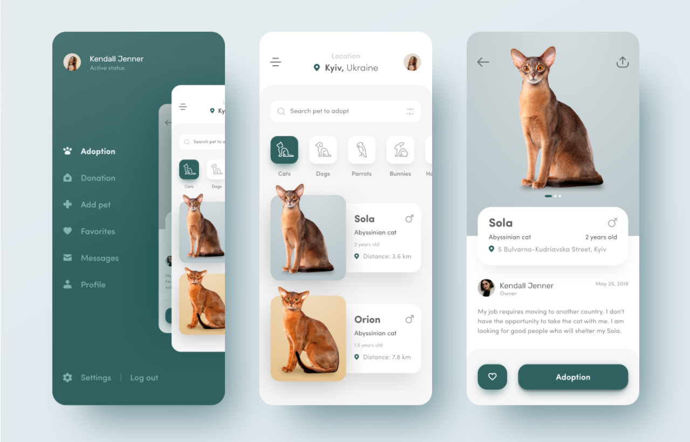
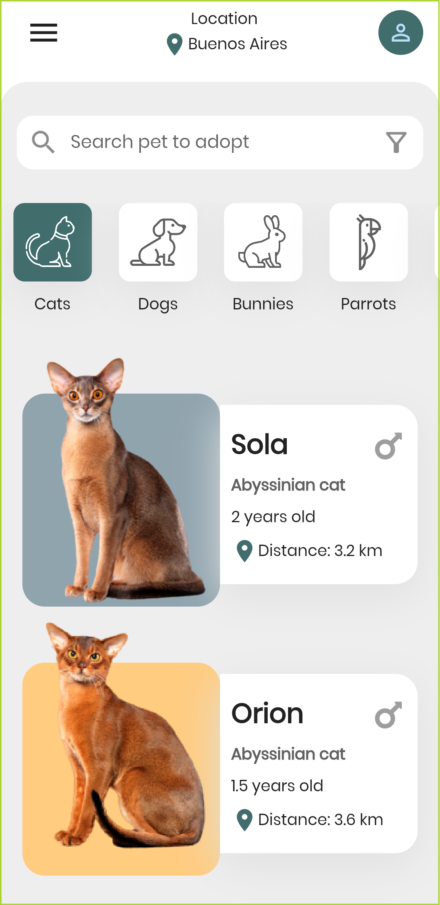
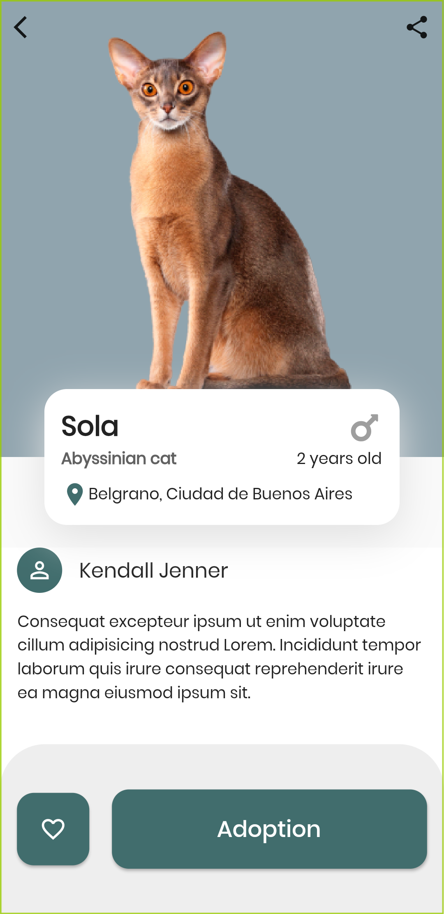
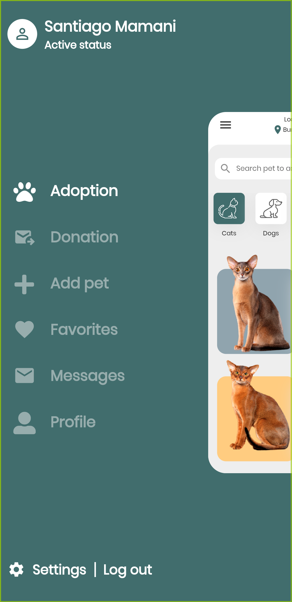

# Pet UI App
 Aplicación mobile hecha en Flutter sobre app de mascotas con menu sidebar animado.
 
# Getting Started
 Para instalar el proyecto se debe ejecutar el siguiente comando en la carpeta raíz del proyecto
 ```
  flutter packages get
```

# Paquetes utilizados

- <a href="https://pub.dev/packages/flutter_riverpod" target="_blank">flutter_riverpod</a>
- <a href="https://pub.dev/packages/google_fonts" target="_blank">google_fonts</a>
- <a href="https://pub.dev/packages/font_awesome_flutter" target="_blank">font_awesome_flutter</a>

# Créditos del diseño
El proyecto está inspirado en el diseño de [Sawan Jaiswal](https://dribbble.com/shots/12217533-Pet-adoption-Store-app).



# Resultado

  

# Demo


